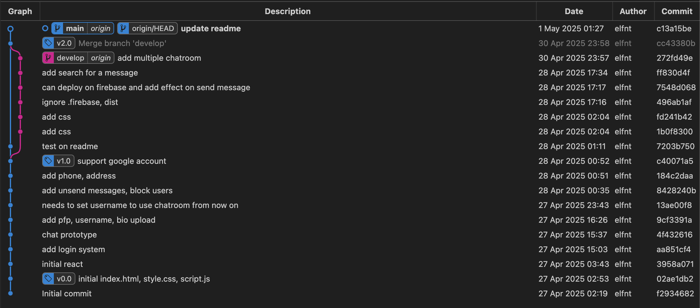
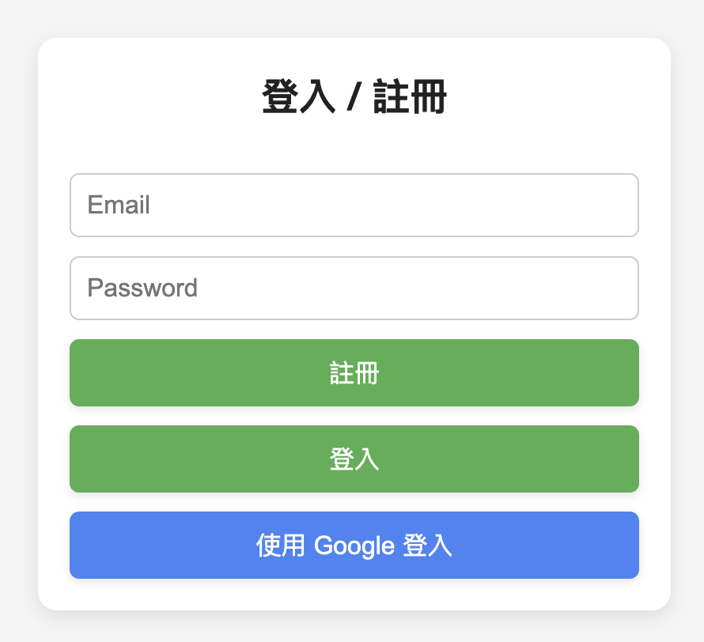
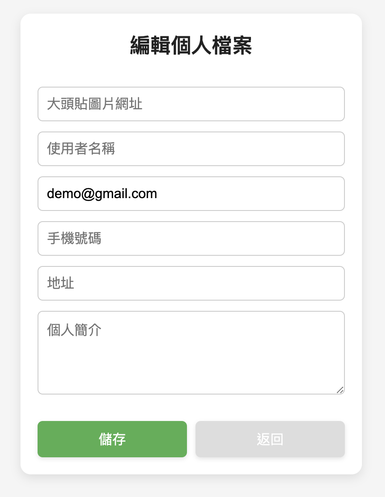
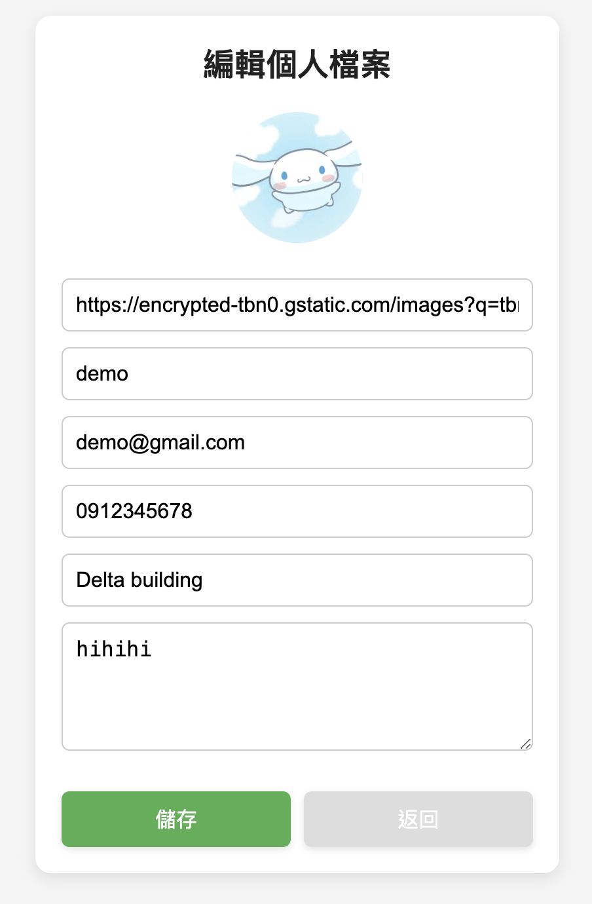
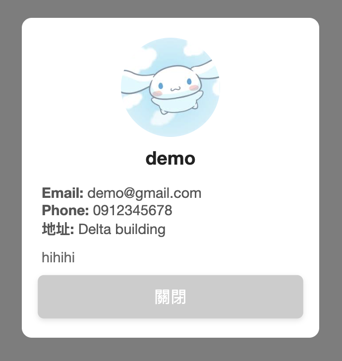
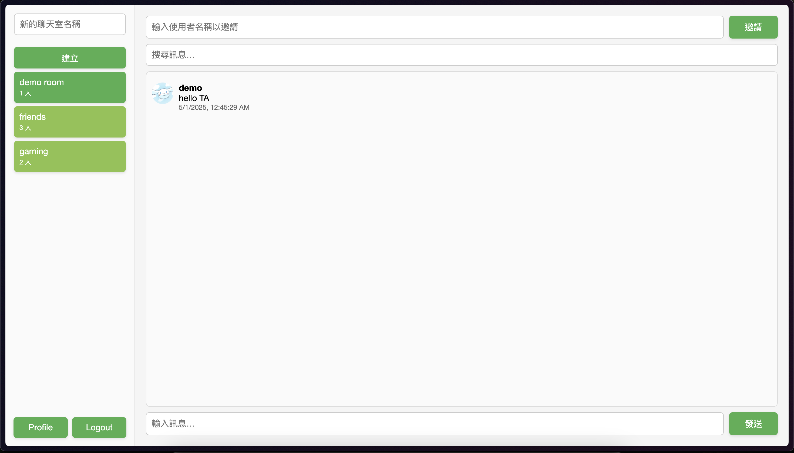

# SS_chatroom 112062203

## Github、Firebase links

https://github.com/elfnt/SS_chatroom/tree/main

https://ss-chatroo.web.app



## Local 端設置

1. 安裝 node.js
2. ```git clone https://github.com/elfnt/SS_chatroom.git```
3.  ```npm install```
4.  ```npm run dev```

## 使用介面

### 登入
登入時可選擇要用一般 email 或是 google 帳號登入


### 個人檔案
- 首次註冊登入後需先輸入 username，否則無法繼續使用
- 若使用 google 登入將無法修改 email
- 在聊天室中可點擊其他人頭像查看資料

|||
|--|--|
|  | 
 |





### 聊天介面

- 左側欄位：
可以選擇要查看的聊天室或建立新的
查看個人檔案與登出
- 上方欄位：
可用 username 邀請其他使用者進當前聊天室
輸入關鍵字即時搜尋訊息
- 下方欄位：
發送訊息
- 中間區域：
顯示聊天內容與互動功能



### 功能 

#### 封鎖用戶
點擊頭像後可以選擇是否封鎖用戶（自己封鎖不了），封鎖後對方的訊息將會變成（已屏蔽）

#### 搜尋訊息
在搜尋訊息的欄位輸入字詞就會過濾出包含該字串的訊息


#### 收回訊息
游標移動到自己的訊息上時，右側會有收回按鈕可以收回訊息

#### 訊息特效
新發送的訊息會有晃動特效

#### Demo 

<video controls>
    <source src="./img/demo.mov" type="video/mp4">
</video>